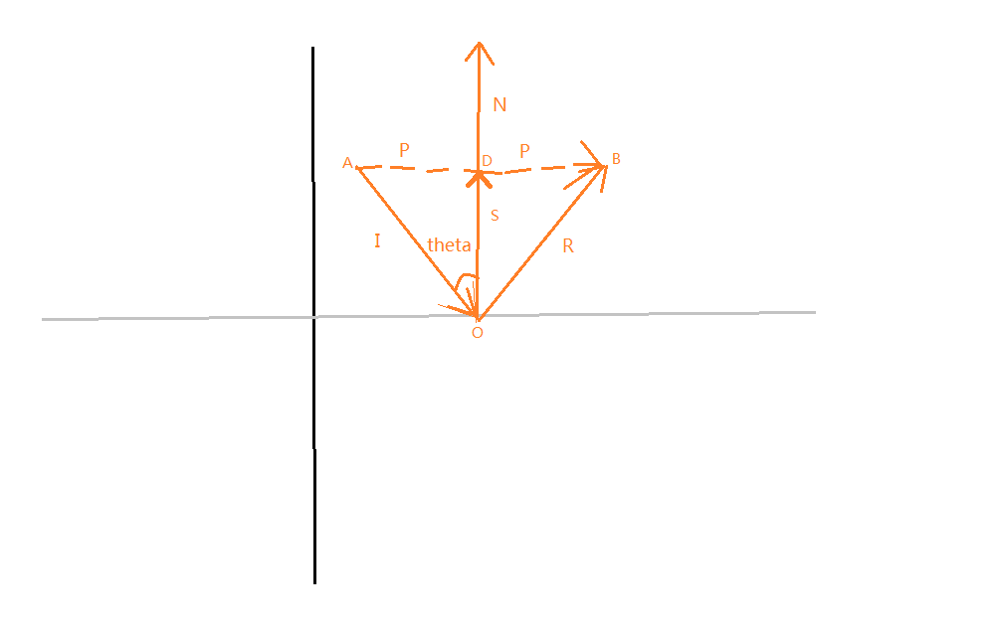

$$
连接向量\vec{I}起点与向量\vec{R}终点，得到向量\vec{AB}
$$

$$
\vec{R}=\vec{AB}-\vec{I}
$$

$$
\because |\vec{I}|=|\vec{R}|
$$

$$
\therefore \Delta AOB是等腰三角形
$$

$$
又\because 向量\vec{N}\bot向量\vec{AB}交于点D，有向量\vec{OD}=\vec{S}
$$

$$
\therefore 向量\vec{S}平分向量\vec{AB} =>\vec{AB}=\vec{AD}+\vec{DB}
$$

$$
又\because \vec{P}=\vec{AD}=\vec{DB}
$$

$$
\therefore \vec{AB}=2\vec{P}
$$

$$
\because \vec{P}=\vec{I}+\vec{S}
$$

$$
又\because \vec{S}是\vec{-I}在\vec{N}上的投影向量
$$

$$
\therefore \vec{S}=\frac{\vec{-I}·\vec{N}}{|\vec{N}|^2}·\vec{N}
$$

$$
若\vec{N}是单位向量
$$

$$
\vec{S}=(\vec{-I}·\vec{N})·\vec{N}
$$

$$
\therefore \vec{P}=\vec{I}+(\vec{-I}·\vec{N})·\vec{N}
$$

$$
\therefore \vec{AB}=2·(\vec{I} + (\vec{-I}·\vec{N})·\vec{N})
$$

$$
=>\vec{AB}=2\vec{I}+2·((\vec{-I}·\vec{N})·\vec{N})
$$

$$
\therefore \vec{R}=2\vec{I}+2·((\vec{-I}·\vec{N})·\vec{N})-\vec{I}
$$

$$
=>\vec{R}=\vec{I}+2·((\vec{-I}·\vec{N})·\vec{N})
$$

$$
=>\vec{R}=\vec{I}-2·((\vec{I}·\vec{N})·\vec{N})
$$

