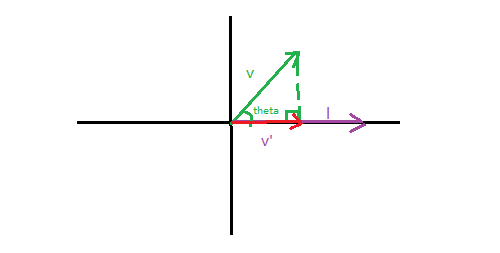

$$
向量\vec{v}在向量\vec{l}上的投影向量\vec{v}^{'}为
$$

$$
\vec{v}^{'}=|\vec{v}^{'}|·\frac{\vec{l}}{|\vec{l}|}
$$

$$
投影向量\vec{v}^{'}的长度为
$$

$$
|\vec{v}^{'}|=|\vec{v}|·cos\theta
$$

$$
向量\vec{v}与向量\vec{l}夹角的余弦值为
$$

$$
cos\theta=\frac{\vec{v}·\vec{l}}{|\vec{v}||\vec{l}|}
$$

$$
\therefore \vec{v}^{'}=|\vec{v}|·\frac{\vec{v}·\vec{l}}{|\vec{v}||\vec{l}|}·\frac{\vec{l}}{|\vec{l}|}
$$

$$
\therefore \vec{v}^{'}=\frac{\vec{v}·\vec{l}}{|\vec{l}|^2}·\vec{l}
$$

$$
如果向量\vec{l}是单位向量
$$

$$
\vec{v}^{'}=\vec{v}·\vec{l}·\vec{l}
$$

$$
\vec{v}^{'}=(\vec{v}·\vec{l})·\vec{l}
$$

